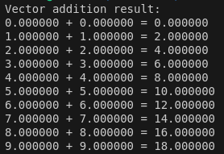

# Installation

## Core utility

- ***clinfo*** - gives insight to information about platforms (NVIDIA, AMD, INTEL) and devices (e.g. RTX 3050 Ti GPU)

- ***opencl-headers*** - headers for openCL

- ***ocl-icd-opencl-dev*** - icd loader manager (allows multiple platforms)


```
sudo install gcc clinfo opencl-headers ocl-icd-opencl-dev
```

## Specific platform utility

### NVIDIA

***nvidia-opencl-icd*** should be included in driver

```
sudo apt install nvidia-opencl-dev
```

### AMD

Replace jammy with current Ubuntu version

```
wget -qO - https://repo.radeon.com/ROCm/apt/keys/ROCm.asc | sudo apt-key add -
echo 'deb [arch=amd64] http://repo.radeon.com/ROCm/apt/ubuntu/ jammy main' | sudo tee /etc/apt/sources.list.d/rocm.list
sudo apt update
```

```
sudo apt install rocm-dkms rocm-opencl rocm-opencl-dev
```

### Intel

```
sudo apt install intel-opencl-icd
```

# Testing

## Platforms and devices information

```
clinfo
```

## Test code

### Code

```c
#include <stdio.h>
#include <stdlib.h>
#include <CL/cl.h>

// OpenCL kernel to perform element-wise vector addition
const char *kernelSource = 
"__kernel void vecAdd(__global float *A, __global float *B, __global float *C) { \n"
"   int id = get_global_id(0);                  \n"
"   C[id] = A[id] + B[id];                      \n"
"}                                              \n";

int main() {
    // 1. Initialize data
    int n = 1024;
    float *A = (float*)malloc(sizeof(float) * n);
    float *B = (float*)malloc(sizeof(float) * n);
    float *C = (float*)malloc(sizeof(float) * n);

    for(int i = 0; i < n; i++) {
        A[i] = i;
        B[i] = i;
    }

    // 2. Get platform and device information
    cl_platform_id platform_id = NULL;
    cl_device_id device_id = NULL;
    cl_uint ret_num_devices;
    cl_uint ret_num_platforms;
    cl_int ret = clGetPlatformIDs(1, &platform_id, &ret_num_platforms);
    ret = clGetDeviceIDs(platform_id, CL_DEVICE_TYPE_DEFAULT, 1, &device_id, &ret_num_devices);

    // 3. Create an OpenCL context
    cl_context context = clCreateContext(NULL, 1, &device_id, NULL, NULL, &ret);

    // 4. Create a command queue
    cl_command_queue command_queue = clCreateCommandQueueWithProperties(context, device_id, 0, &ret);

    // 5. Create memory buffers on the device for the vectors A, B, and C
    cl_mem buffer_A = clCreateBuffer(context, CL_MEM_READ_ONLY, n * sizeof(float), NULL, &ret);
    cl_mem buffer_B = clCreateBuffer(context, CL_MEM_READ_ONLY, n * sizeof(float), NULL, &ret);
    cl_mem buffer_C = clCreateBuffer(context, CL_MEM_WRITE_ONLY, n * sizeof(float), NULL, &ret);

    // 6. Copy the lists A and B to their respective memory buffers
    ret = clEnqueueWriteBuffer(command_queue, buffer_A, CL_TRUE, 0, n * sizeof(float), A, 0, NULL, NULL);
    ret = clEnqueueWriteBuffer(command_queue, buffer_B, CL_TRUE, 0, n * sizeof(float), B, 0, NULL, NULL);

    // 7. Create a program from the kernel source
    cl_program program = clCreateProgramWithSource(context, 1, (const char **)&kernelSource, NULL, &ret);

    // 8. Build the program
    ret = clBuildProgram(program, 1, &device_id, NULL, NULL, NULL);

    // 9. Create the OpenCL kernel
    cl_kernel kernel = clCreateKernel(program, "vecAdd", &ret);

    // 10. Set the arguments of the kernel
    ret = clSetKernelArg(kernel, 0, sizeof(cl_mem), (void *)&buffer_A);
    ret = clSetKernelArg(kernel, 1, sizeof(cl_mem), (void *)&buffer_B);
    ret = clSetKernelArg(kernel, 2, sizeof(cl_mem), (void *)&buffer_C);

    // 11. Execute the OpenCL kernel on the list
    size_t global_item_size = n; // Process the entire lists
    size_t local_item_size = 64; // Divide work items into groups of 64
    ret = clEnqueueNDRangeKernel(command_queue, kernel, 1, NULL, &global_item_size, &local_item_size, 0, NULL, NULL);

    // 12. Read the memory buffer C on the device to the local variable C
    ret = clEnqueueReadBuffer(command_queue, buffer_C, CL_TRUE, 0, n * sizeof(float), C, 0, NULL, NULL);

    // 13. Display the result to check correctness
    printf("Vector addition result: \n");
    for(int i = 0; i < 10; i++) { // print first 10 elements for brevity
        printf("%f + %f = %f\n", A[i], B[i], C[i]);
    }

    // 14. Clean up
    ret = clFlush(command_queue);
    ret = clFinish(command_queue);
    ret = clReleaseKernel(kernel);
    ret = clReleaseProgram(program);
    ret = clReleaseMemObject(buffer_A);
    ret = clReleaseMemObject(buffer_B);
    ret = clReleaseMemObject(buffer_C);
    ret = clReleaseCommandQueue(command_queue);
    ret = clReleaseContext(context);
    free(A);
    free(B);
    free(C);
    
    return 0;
}
```

### Compilation

```
gcc -o main main.c -lOpenCL
```

### Execution

```
./main
```

### Output


